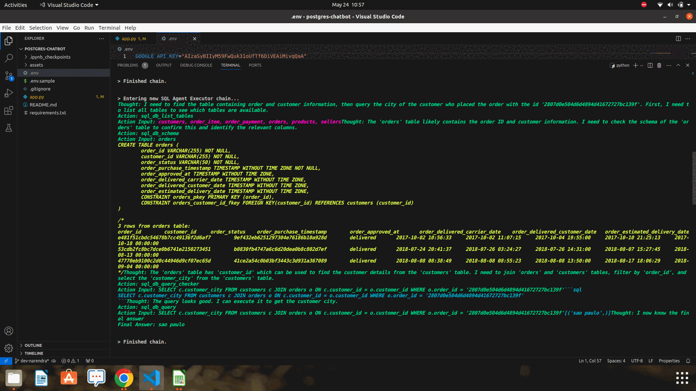

# README.md

## Project Title: Postgres Chatbot with Streamlit


### Introduction

This project aims to develop a chatbot that can interact with a PostgreSQL database and answer queries in natural language. The chatbot will be able to handle queries related to an `Orders` table, which includes columns such as `order_id`, `customer_email`, `tracking_number`, `shipping_service`, `tracking_URL`, `order_created_at`, and `order_shipped_at`.

The chatbot will be designed to understand and respond to layman language questions, such as:
1. "Give me the status of order number 12222."
2. "What is the order ID of tracking number?"
3. "How many orders are shipped?"

A user interface will be created using Streamlit where users can input their PostgreSQL credentials and ask questions.

### Setup Instructions

Follow these steps to set up the project on your local machine:


**1. Clone the Repository**
Begin by cloning the repository to your local machine:
```
https://github.com/langchain-tech/postgres-chatbot.git
cd postgres-chatbot
```

**2. Create a Virtual Environment**
It is recommended to create a virtual environment to manage dependencies:
```
python -m venv venv
source venv/bin/activate   # On Windows, use `venv\Scripts\activate`
```

**3. Install Dependencies**
Install the necessary packages listed in the requirements.txt file:
```
pip install -r requirements.txt
```


**4. Set Up Environment Variables**
Create a .env file in the root directory of your project and add the required environment variables. For example:
```
GOOGLE_API_KEY=your_gemini_api_key
```


**5. Start the Application**

Run the application using Streamlit:
```
streamlit run app.py
```


## How to use 

### Notes

- Questions will not be limited to one table, so it should be done to ask from database
- As long as entry is added into database, we should be able to answer questions for that new record
